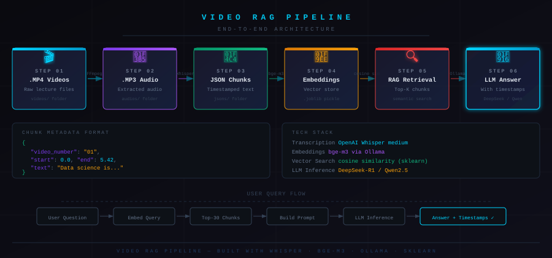

<div align="center">

# Video Course RAG Assistant

### Turn a folder of lecture videos into a searchable AI tutor with timestamped video recommendations.

[](https://www.python.org/)
[](https://github.com/openai/whisper)
[](https://ffmpeg.org/)
[](https://ollama.com/)
[](https://groq.com/)

</div>



## Overview

Video Course RAG Assistant is a local-first Retrieval-Augmented Generation pipeline that turns YouTube lecture videos into a question-answering assistant. It extracts audio from `.mp4` videos, transcribes the audio with Whisper, merges transcript segments into useful retrieval chunks, creates embeddings with `bge-m3` through Ollama, and uses Groq to generate beginner-friendly answers.

The assistant also returns the most relevant video segment, so the user does not just get an answer. They also know exactly which lecture to watch and where to start.

## What This Project Does

- Converts downloaded course videos from `.mp4` to `.mp3`
- Transcribes audio into timestamped JSON using OpenAI Whisper
- Merges small transcript segments into better semantic chunks
- Creates local embeddings using Ollama and `bge-m3`
- Stores all chunks and embeddings in a `joblib` file
- Retrieves the most relevant chunks using cosine similarity
- Sends retrieved context to Groq for a natural-language answer
- Prints a recommended video title and timestamp range

## Example Output

```text
Ask Anything: what is data science

Answer:
Data science is the field of using data to find useful insights, patterns, and answers. It combines statistics, programming, mathematics, and business understanding to solve real-world problems.

For example, Netflix can use data science to recommend movies, companies can predict sales, and banks can detect fraud. A data scientist usually collects data, cleans it, analyzes it, builds models, and explains the results clearly.

Next step:
- Start with Python basics, SQL, and simple data analysis using Pandas.

Best video:
- 01 what is data science roadmap.mp3
- 0:00 -> 0:37
```

## Pipeline

```text
videos/
  raw .mp4 lectures
        |
        v
videos_to_mp3.py
  FFmpeg converts video to audio
        |
        v
audios/
  .mp3 files
        |
        v
mp3_to_jsons.py
  Whisper transcribes audio into timestamped JSON
        |
        v
jsons/
  transcript chunks
        |
        v
merge_chunks.py
  combines small chunks into better retrieval windows
        |
        v
merged_jsons/
  cleaned merged chunks
        |
        v
preprocessed_json.py
  creates bge-m3 embeddings with Ollama
        |
        v
chunks_embeddings.joblib
  searchable embedding store
        |
        v
process_incoming.py
  retrieves chunks, builds prompt, calls Groq
        |
        v
answer + best video timestamp
```

## Project Structure

```text
.
├── videos/
│   └── 01_what_is_data_science.mp4
├── audios/
│   └── 01_what_is_data_science.mp3
├── jsons/
│   └── 01_what_is_data_science.mp3.json
├── merged_jsons/
│   └── 01_what_is_data_science.mp3.json
├── videos_to_mp3.py
├── mp3_to_jsons.py
├── merge_chunks.py
├── preprocessed_json.py
├── process_incoming.py
├── config.py
├── chunks_embeddings.joblib
├── prompt.txt
├── response.txt
├── pipeline.svg
└── README.md
```

## Tech Stack

| Layer | Tool | Purpose |
|---|---|---|
| Video processing | FFmpeg | Converts `.mp4` lectures into `.mp3` audio |
| Transcription | OpenAI Whisper | Converts speech into timestamped text |
| Chunking | Python | Merges transcript segments into retrieval-friendly chunks |
| Embeddings | Ollama + `bge-m3` | Creates semantic vectors locally |
| Retrieval | scikit-learn | Uses cosine similarity to find relevant chunks |
| Storage | pandas + joblib | Stores chunks, metadata, and embeddings |
| Generation | Groq API | Produces the final answer from retrieved context |

## Installation

### 1. Clone the Repository

```bash
git clone https://github.com/YOUR_USERNAME/YOUR_REPO_NAME.git
cd YOUR_REPO_NAME
```

### 2. Create a Virtual Environment

```bash
python -m venv venv
```

Windows:

```bash
venv\Scripts\activate
```

macOS/Linux:

```bash
source venv/bin/activate
```

### 3. Install Python Packages

```bash
pip install openai-whisper pandas numpy scikit-learn joblib requests
```

Depending on your system, Whisper may also require PyTorch. If Whisper installation fails, install PyTorch first from the official instructions:

[https://pytorch.org/get-started/locally/](https://pytorch.org/get-started/locally/)

### 4. Install FFmpeg

Windows:

Download FFmpeg from [https://ffmpeg.org/download.html](https://ffmpeg.org/download.html) and add the `bin` folder to your system PATH.

macOS:

```bash
brew install ffmpeg
```

Ubuntu/Debian:

```bash
sudo apt install ffmpeg
```

### 5. Install Ollama and Pull the Embedding Model

Install Ollama from:

[https://ollama.com/](https://ollama.com/)

Then pull the embedding model:

```bash
ollama pull bge-m3
```

Make sure Ollama is running locally before creating embeddings:

```bash
ollama serve
```

### 6. Add Your Groq API Key

Create a `config.py` file:

```python
GROQ_API_KEY = "your_groq_api_key_here"
```

Do not commit `config.py` to GitHub. Add it to `.gitignore`:

```gitignore
config.py
chunks_embeddings.joblib
prompt.txt
response.txt
videos/
audios/
jsons/
merged_jsons/
```

## Usage

### Step 1: Convert Videos to MP3

Put your downloaded `.mp4` files inside the `videos/` folder.

Recommended naming format:

```text
01_what_is_data_science.mp4
02_data_science_roadmap.mp4
03_machine_learning_introduction.mp4
```

Run:

```bash
python videos_to_mp3.py
```

This creates `.mp3` files inside `audios/`.

### Step 2: Transcribe Audio to JSON

Run:

```bash
python mp3_to_jsons.py
```

This uses Whisper to create timestamped transcript chunks.

Example JSON chunk:

```json
{
  "video_number": "01",
  "video_title": "what is data science",
  "start": 0.0,
  "end": 37.0,
  "text": "Data science is a mixture of math, statistics, programming, data and machine learning."
}
```

### Step 3: Merge Small Transcript Chunks

Run:

```bash
python merge_chunks.py
```

This creates better chunks for retrieval by combining nearby transcript segments. The merged chunks keep the original video number, title, start time, end time, and source file.

### Step 4: Create Embeddings

Make sure Ollama is running and `bge-m3` is available.

Run:

```bash
python preprocessed_json.py
```

This creates:

```text
chunks_embeddings.joblib
```

That file contains a pandas DataFrame with:

- chunk text
- video number
- video title
- start timestamp
- end timestamp
- embedding vector
- source file

### Step 5: Ask Questions

Run:

```bash
python process_incoming.py
```

Then ask a question:

```text
Ask Anything: what is machine learning
```

The script will:

1. Convert your question into an embedding
2. Search the saved transcript chunks
3. Pick the most relevant chunks
4. Build a Groq prompt
5. Generate a beginner-friendly answer
6. Print the best video and timestamp

## Important Files

### `videos_to_mp3.py`

Converts all `.mp4` files from `videos/` into `.mp3` files inside `audios/` using FFmpeg.

### `mp3_to_jsons.py`

Uses Whisper `medium` to transcribe each `.mp3` file. It stores the transcript as JSON with timestamps and video metadata.

### `merge_chunks.py`

Merges transcript chunks using a sliding-window strategy. This improves retrieval because tiny transcript segments often do not contain enough meaning by themselves.

### `preprocessed_json.py`

Reads merged JSON files, sends chunk text to Ollama's `/api/embed` endpoint, and saves the final embedding DataFrame as `chunks_embeddings.joblib`.

### `process_incoming.py`

Handles the question-answering flow:

- embeds the user query
- compares it with all saved chunk embeddings
- retrieves the top matching chunks
- creates a structured prompt
- calls the Groq API
- prints the answer and best video timestamp

## Why This Project Uses RAG

Large language models do not automatically know what is inside your private videos. RAG solves this by giving the model only the most relevant transcript sections at answer time.

Instead of asking the model to guess, this project follows a grounded flow:

```text
Question -> Search transcript chunks -> Send relevant context -> Generate answer
```

That makes the answer more connected to the course content and allows the assistant to recommend the exact video segment.

## Prompting Strategy

The Groq prompt is designed to produce answers that are:

- beginner-friendly
- broad enough to be useful
- grounded in the retrieved transcript
- formatted with an answer, next step, and best video
- not overly robotic or too short

The current target style is:

```text
Answer:
2-4 short paragraphs with examples and simple explanation.

Next step:
- One practical beginner action.

Best video:
- Video title
- MM:SS -> MM:SS
```

## Notes About Groq Free Tier

This project uses the Groq API for generation. Free-tier models may sometimes produce shorter or less polished answers than premium chat models. The prompt in `process_incoming.py` is intentionally written to guide the model toward clearer, ChatGPT-style explanations.

For better answers:

- retrieve more chunks with `TOP_RESULTS = 8`
- keep `temperature` around `0.3` to `0.5`
- keep `max_tokens` around `700`
- make the prompt format simple and direct
- let Python handle video formatting instead of asking the model to do it

## Current Limitations

- No web UI yet; interaction happens through the terminal
- Embeddings are stored in `joblib`, not a production vector database
- Groq output quality depends on the selected model and free-tier limits
- Whisper transcription can take time on CPU
- The system works best when file names contain a clear video number and title

## Roadmap

- [x] Convert `.mp4` lecture videos to `.mp3`
- [x] Transcribe audio with Whisper
- [x] Save timestamped JSON chunks
- [x] Merge chunks for better retrieval
- [x] Create local embeddings with Ollama `bge-m3`
- [x] Store embeddings in `chunks_embeddings.joblib`
- [x] Retrieve relevant chunks with cosine similarity
- [x] Generate answers with Groq
- [x] Return best video and timestamp
- [ ] Add Streamlit or Gradio chat UI
- [ ] Add automatic YouTube download support
- [ ] Add FAISS or ChromaDB for larger datasets
- [ ] Add multi-course filtering
- [ ] Add source confidence scores in the final output

## Suggested `.gitignore`

```gitignore
__pycache__/
*.pyc
venv/
.env
config.py

videos/
audios/
jsons/
merged_jsons/

chunks_embeddings.joblib
prompt.txt
response.txt
```

## Acknowledgements

- [FFmpeg](https://ffmpeg.org/) for video and audio processing
- [OpenAI Whisper](https://github.com/openai/whisper) for speech transcription
- [Ollama](https://ollama.com/) for running local embedding models
- [BAAI bge-m3](https://huggingface.co/BAAI/bge-m3) for multilingual embeddings
- [Groq](https://groq.com/) for fast LLM inference

## Disclaimer

This project is for learning and experimentation. If you process YouTube videos or online courses, make sure you have the right to download and use that content.

<div align="center">

Built to turn passive video watching into active, searchable learning.

</div>
