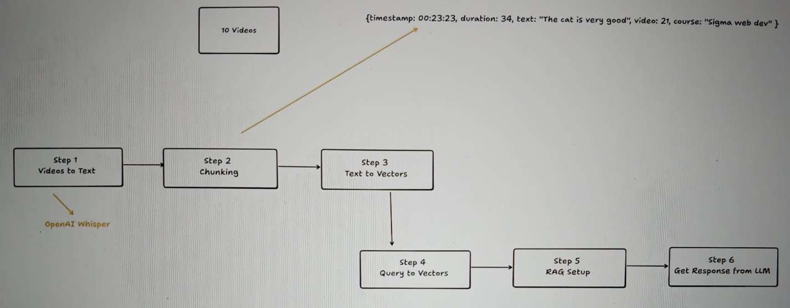

<div align="center">

# 🎬 Video RAG Pipeline

### *Turn any video course into a conversational AI tutor*

[](https://python.org)
[](https://github.com/openai/whisper)
[](https://ffmpeg.org)
[]()

<br/>

> **Ask questions about your entire video course — and get answers with exact timestamps.**  
> Built on top of *Code With Harry's* Data Science course as a real-world RAG use case.

</div>

---

## 🗺️ Pipeline Architecture

<div align="center">



*End-to-end pipeline: from raw `.mp4` files to LLM-powered Q&A with timestamped citations*

</div>

Each chunk produced by the pipeline carries rich metadata — for example:

```json
{
  "timestamp": "00:23:23",
  "duration": 34,
  "text": "The cat is very good",
  "video": 21,
  "course": "Sigma web dev"
}
```

---

## ✅ Progress Tracker

| Step | Description | Tool / Model | Status |
|------|-------------|--------------|--------|
| **Step 1** | Videos → Text (transcription) | OpenAI Whisper `medium` | ✅ Done |
| **Step 2** | Chunking transcripts into segments | Custom JSON chunker | ✅ Done |
| **Step 3** | Text → Vectors (embeddings) | Embedding model | 🔜 Next |
| **Step 4** | Query → Vectors (semantic search) | Vector DB | ⏳ Pending |
| **Step 5** | RAG Setup (retrieval context) | LangChain / custom | ⏳ Pending |
| **Step 6** | Get Response from LLM | GPT / Claude | ⏳ Pending |

---

## 📁 Project Structure

```
video-rag-pipeline/
│
├── videos/                  # Raw .mp4 lecture files
│   └── 01_what_is_data_science.mp4
│
├── audios/                  # Extracted .mp3 files (via FFmpeg)
│   └── 01_what is data science.mp3
│
├── jsons/                   # Whisper transcript chunks with metadata
│   └── 01_what is data science.mp3.json
│
├── pipeline/
│   ├── video_to_audio.py    # Step 1a — FFmpeg video → mp3
│   ├── audio_to_chunks.py   # Step 1b+2 — Whisper transcription + chunking
│   └── ...                  # Steps 3–6 coming soon
│
└── README.md
```

---

## ⚙️ Setup & Installation

```bash
# Clone the repo
git clone https://github.com/yourusername/video-rag-pipeline.git
cd video-rag-pipeline

# Install dependencies
pip install openai-whisper

# FFmpeg must be installed on your system
# Ubuntu/Debian:
sudo apt install ffmpeg
# macOS:
brew install ffmpeg
```

---

## 🚀 Usage

### Step 1 — Convert Videos to Audio

Extracts audio from all `.mp4` files in the `videos/` folder and saves them as `.mp3` in `audios/`.

```python
# pipeline/video_to_audio.py

import os
import subprocess

os.makedirs('audios', exist_ok=True)

files = os.listdir('videos')
for file in files:
    video_number = file.split('_')[0]
    video_name = '_'.join(file.split('_')[1:]).replace('.mp4', '')
    subprocess.run(['ffmpeg', '-i', f"videos/{file}", f"audios/{video_number}_{video_name}.mp3"])
```

```bash
python pipeline/video_to_audio.py
```

---

### Step 2 — Transcribe & Chunk Audio

Runs OpenAI Whisper on each audio file, translates to English, and saves timestamped chunks as JSON.

```python
# pipeline/audio_to_chunks.py

import whisper
import json
import os

model = whisper.load_model("medium")
os.makedirs('jsons', exist_ok=True)

for audio in os.listdir('audios'):
    parts = audio.split('_', 1)
    audio_number = parts[0]
    audio_title = parts[1].replace('_', ' ')[:-4]

    result = model.transcribe(
        audio=f"audios/{audio}",
        task="translate",
        word_timestamps=False,
        fp16=False,
        verbose=True,
    )

    chunks = [
        {
            "video_number": audio_number,
            "video_title": audio_title,
            "start": seg["start"],
            "end": seg["end"],
            "text": seg["text"]
        }
        for seg in result["segments"]
    ]

    with open(f"jsons/{audio}.json", "w") as f:
        json.dump({"chunks": chunks, "text": result["text"]}, f)
```

```bash
python pipeline/audio_to_chunks.py
```

**Output format** (one JSON per video):
```json
{
  "chunks": [
    {
      "video_number": "01",
      "video_title": "what is data science",
      "start": 0.0,
      "end": 5.42,
      "text": " Data science is the study of data..."
    }
  ],
  "text": "Full transcript..."
}
```

---

## 🧠 Why This Approach?

| Design Choice | Reason |
|---------------|--------|
| **Whisper `medium` model** | Best balance of speed and accuracy for Hindi-accented English |
| `task="translate"` | Normalizes any Hindi segments into English for consistent embeddings |
| **Segment-level chunking** | Preserves natural sentence boundaries + gives exact timestamps |
| **JSON with metadata** | Makes it easy to cite the exact video + timestamp when answering |

---

## 🔮 Roadmap

- [ ] **Step 3** — Generate embeddings using `text-embedding-3-small` or `sentence-transformers`
- [ ] **Step 4** — Store vectors in ChromaDB / Pinecone; implement semantic search
- [ ] **Step 5** — Build RAG retrieval chain with LangChain
- [ ] **Step 6** — Connect to GPT-4 / Claude for final answers with source timestamps
- [ ] Build a simple chat UI (Streamlit or Gradio)

---

## 🙏 Acknowledgements

- **[Code With Harry](https://www.codewithharry.com/)** — for the original Data Science course content used as the dataset
- **[OpenAI Whisper](https://github.com/openai/whisper)** — for the incredible open-source transcription model
- **[FFmpeg](https://ffmpeg.org/)** — for reliable, blazing-fast audio extraction

---

<div align="center">

Made with 🔥 while grinding through a Data Science course

*Turning passive watching into active, searchable knowledge*

</div>
